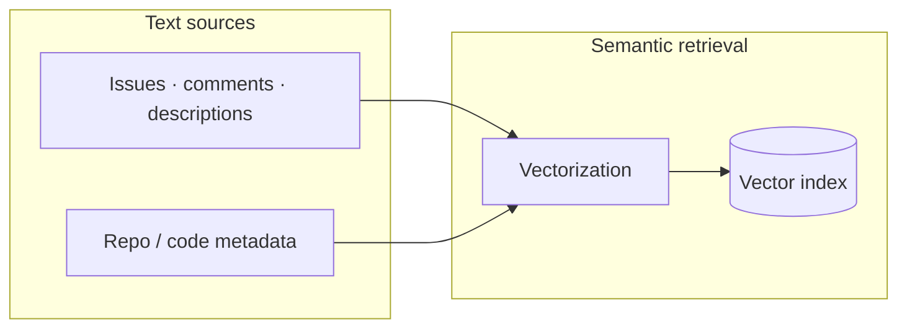
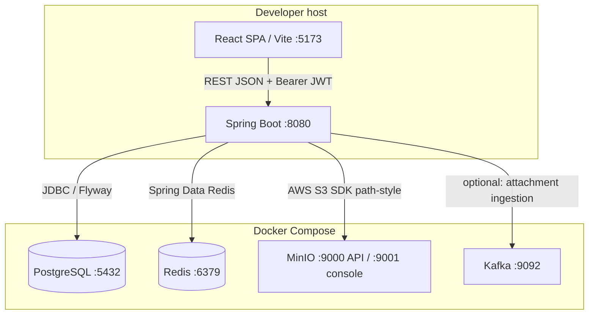

# Jira Agentic AI

Full-stack **Jira-style** workspace demo: **Spring Boot 3** REST API plus a **React (Vite)** SPA that lives in a **separate repository** (`sprint-orchestra-studio`), with **PostgreSQL**, **Redis** cache, **Flyway** migrations, and gateway-side **JWT** validation (OAuth2 Resource Server) for protected APIs.

---

## Table of contents

- [Features](#features)
- [Tech stack](#tech-stack)
- [Repository layout](#repository-layout)
- [Core docs](#core-docs)
- [Architecture](#architecture)
- [Prerequisites](#prerequisites)
- [Local development](#local-development)
- [Configuration](#configuration)
- [Database & Flyway](#database--flyway)
- [Authentication & authorization](#authentication--authorization)
- [HTTP API overview](#http-api-overview)
- [OpenAPI (Swagger)](#openapi-swagger)
- [Frontend](#frontend)
- [Build, test, quality](#build-test-quality)
- [Production deployment checklist](#production-deployment-checklist)
- [Security notes](#security-notes)
- [Troubleshooting](#troubleshooting)
- [Attachments, deletes & Kafka](#attachments-deletes--kafka)
- [Target platform architecture](./docs/ARCHITECTURE.md)

---

## Features

- **Spaces**, **members**, **groups** linked to spaces, **sprints**, **issues** (with backlog/board-style UI), **comments**
- **Attachments** stored via configurable backend: local filesystem or S3-compatible storage (MinIO in local PoC); optional **Kafka** notification after each successful upload (see [Attachments, deletes & Kafka](#attachments-deletes--kafka))
- **GitHub repo integration** + issue code links + metadata refresh flows
- **JWT** issued via `POST /api/auth/token`; SPA stores token and sends `Authorization: Bearer …`
- **Redis**-backed Spring Cache for user-by-id reads (TTL aligned with `application.yml`)
- **Flyway** for versioned schema (`V1`..`V17`); JPA `ddl-auto: validate` in default config
- **springdoc-openapi** + Swagger UI for API exploration

---

## Tech stack

| Layer | Technology |
|--------|------------|
| Backend | Java 17, Spring Boot 3.2, Spring Data JPA, Spring Security (JWT / optional OAuth2 login) |
| Database | PostgreSQL 15 |
| Migrations | Flyway 9.x |
| Cache | Spring Cache → Redis (JSON values, TTL) |
| Object storage | MinIO (local S3-compatible) / AWS S3-compatible API |
| API docs | springdoc-openapi 2.x |
| Frontend | React 19, TypeScript 5.x, Vite 7, React Router 7, `@hello-pangea/dnd` |
| Dev infra | Docker Compose (Postgres + Redis + MinIO + optional Kafka / Kafka UI) |
| Messaging (optional) | Apache Kafka via Spring Kafka; POC consumer module `tmp-kafka-consumer-poc` |

---

## Repository layout

```
sprint-orchestra-core/
├── docker-compose.yml              # PostgreSQL + Redis + MinIO + Kafka (+ Kafka UI)
├── build.gradle.kts                # aggregator (group/version + shared repos)
├── settings.gradle.kts             # multi-module: jira-backend + gateway + tmp-kafka-consumer-poc
├── gradlew / gradlew.bat
├── README.md
├── docs/                            # Architecture, API design, schema, and ER diagram
│   ├── ARCHITECTURE.md
│   ├── API_DESIGN_CORE.md
│   ├── DATABASE_SCHEMA_CORE.md
│   └── visual-er-diagram.html
├── jira-backend/                   # Spring Boot REST API (main app)
│   ├── build.gradle.kts
│   └── src/
│       ├── main/java/com/jiraagentic/app/   # root package (controllers, services, …)
│       ├── main/resources/                  # application.yml, Flyway db/migration/
│       └── test/java/
├── gateway/                        # Spring Cloud Gateway (optional local edge)
│   ├── build.gradle.kts
│   └── src/main/java/com/jiraagentic/gateway/
└── tmp-kafka-consumer-poc/         # Temporary POC: logs attachment-upload Kafka messages
    ├── build.gradle.kts
    └── src/main/java/com/jiraagentic/poc/kafka/
```

The **SPA** is not in this tree: clone or check out **`sprint-orchestra-studio`** (sibling repo / folder at repo root with `package.json`, `vite.config.ts`, `src/`, etc.).

---

## Core docs

- [Target architecture](./docs/ARCHITECTURE.md) (Kafka / vectorization / AI / observability)
- [API design](./docs/API_DESIGN_CORE.md)
- [Database schema](./docs/DATABASE_SCHEMA_CORE.md)
- [Visual ER diagram](./docs/visual-er-diagram.html)

---

## Architecture

**Target platform view**（Gateway、合併後核心服務、Kafka、獨立 Vectorization / AI、可觀測性模型）見 **[`docs/ARCHITECTURE.md`](./docs/ARCHITECTURE.md)**。

下列圖表侧重 **目前 repo 已落地的** Spring monolith 與資料路徑。

```mermaid
flowchart LR
  subgraph client [Browser]
    SPA[React SPA]
  end
  subgraph server [Spring Boot]
    CTRL[Controllers]
    SVC[Services]
    JPA[JPA Repositories]
  end
  subgraph data [Data]
    PG[(PostgreSQL)]
    RD[(Redis)]
    S3[(MinIO / S3)]
  end
  SPA -->|HTTPS JSON + JWT| CTRL
  CTRL --> SVC
  SVC --> JPA
  SVC -->|@Cacheable users| RD
  SVC -->|Attachments| S3
  JPA --> PG
```

**Terminology:** Use **vectorization** for the step where text is turned into embedding vectors (search / RAG). Earlier informal notes sometimes used a misheard name for this step; standardize on **vectorization** in all diagrams and prose. A repository-wide search shows no legacy misspelling in code or docs—only use the correct term going forward.

**Retrieval / embedding view (naming — optional RAG layer):** Same product boundary as above, with an explicit **vectorization** step (this repo’s shipped stack is still the Spring + Postgres + Redis + S3 path in the first diagram; a vector index is shown here only as the usual companion when you add semantic retrieval).



**Typical request flow (cached user read):** `GET /api/users/{id}` → service checks Redis cache (`users` cache) → on miss, loads from PostgreSQL and populates cache (TTL ~60s).

### Runtime topology (local development)

How processes fit on one machine: the SPA (usually Vite on port **5173**) talks to Spring Boot (**8080**); the backend reaches data services from **Docker Compose** (defaults from `docker-compose.yml`).



---

## Prerequisites

- **JDK 17**
- **Docker** + Docker Compose (recommended for Postgres, Redis, MinIO; add Kafka services when exercising attachment → Kafka POC)
- **Node.js 20+** (or compatible) and **npm** for the SPA (**sprint-orchestra-studio** repo)

---

## Local development

### 1. Start Docker Compose (from this repo root)

Run in the directory that contains **`docker-compose.yml`** (the **`sprint-orchestra-core`** repo root):

```bash
cd /path/to/sprint-orchestra-core
docker compose up -d
# docker-compose up -d   # if your Docker CLI uses the legacy command
docker ps
```

Compose file defines:

| Service | Container | Port | DB / notes |
|---------|-----------|------|------------|
| postgres | `poc-postgres` | 5432 | DB `pocdb`, user `poc`, password `poc123` |
| redis | `poc-redis` | 6379 | No auth in default compose |
| minio | `poc-minio` | 9000 (S3), 9001 (console) | Access key/secret: `minioadmin` |
| zookeeper | `poc-zookeeper` | 2181 | For local Kafka |
| kafka | `poc-kafka` | 9092 | Broker (`localhost:9092` from host) |
| kafka-ui | `poc-kafka-ui` | 8989 | UI → `http://localhost:8989` |

MinIO console: `http://localhost:9001`

**Kafka (optional):** When **`APP_KAFKA_ATTACHMENT_INGESTION_ENABLED=true`**, **jira-backend** publishes a small **tracking JSON** after each successful attachment upload (topic **`jira.attachment.ingestion`**, override with **`APP_KAFKA_ATTACHMENT_INGESTION_TOPIC`**). Fields include **`eventId`**, **`eventType`**, **`issueKey`**, **`attachmentId`**, **`filename`**, **`byteSize`**, **`storageBackend`**, **`storageKey`**, **`emittedAt`**, etc., so you can correlate logs across services. Broker: **`SPRING_KAFKA_BOOTSTRAP_SERVERS`** (default `localhost:9092`).

**Quick POC — prove messages are consumed:** with Compose Kafka up, enable the producer (`APP_KAFKA_ATTACHMENT_INGESTION_ENABLED=true` in your environment), run **`./gradlew :jira-backend:bootRun`**, then **`./gradlew :tmp-kafka-consumer-poc:bootRun`**. Trigger an attachment **upload** (see SPA behaviour below) and watch the **Tmp Kafka POC** console for **`[tmp-kafka-consumer-poc]`** lines (**`System.out`** + SLF4J).

**Kafka UI:** open **`http://localhost:8989`** → cluster **local** → **Topics** → **`jira.attachment.ingestion`** (or your `APP_KAFKA_ATTACHMENT_INGESTION_TOPIC`) → **Messages** to inspect payloads / offsets.

**Local credentials:** provide OAuth credentials and other secrets through environment variables. IntelliJ `.run/` configurations are gitignored; never commit credentials in run configurations or project files.

### 2. Run the backend

```bash
./gradlew :jira-backend:bootRun
```

Serves the API directly on **http://localhost:8081** (see `server.port` in `jira-backend/src/main/resources/application.yml`). Requires Postgres, Redis, and MinIO to be reachable using `application.yml` defaults.

**8081 is not the URL the SPA or the smoke test below use.** They go through the gateway.

### 3. Run the gateway

```bash
./gradlew :gateway:bootRun
```

Listens on **http://localhost:8080** and proxies `/api/**`, Swagger, and OAuth2/login paths to the backend on 8081 (see `gateway/src/main/resources/application.yml`). This is the entry point browsers and the SPA should call — never point the SPA at 8081 directly, since the browser can't send the internal `X-Gateway-Internal` trust header the backend requires.

### 4. Run the SPA (separate repo)

Check out **`sprint-orchestra-studio`** next to this project (or anywhere), then:

```bash
cd sprint-orchestra-studio   # path to the standalone Vite app
npm install
npm run dev
```

Default Vite dev server: **http://localhost:5173**

Point the SPA at the API (see [Frontend](#frontend)); backend still expects `FRONTEND_BASE_URL` / `app.frontend.base-url` (default `http://localhost:5173`) for OAuth redirects.

### 5. Smoke test

- Health / root: `GET http://localhost:8080/`
- Obtain JWT:

```bash
curl -s -X POST http://localhost:8080/api/auth/token \
  -H "Content-Type: application/json" \
  -d '{"username":"<your-user>","password":"<password>"}'
```

- Call a protected endpoint:

```bash
curl -s http://localhost:8080/api/spaces \
  -H "Authorization: Bearer <access_token>"
```

---

## Configuration

Configuration is in **`jira-backend/src/main/resources/application.yml`**. For **12-factor** / production, override with environment variables (Spring Boot relaxed binding).

| Concern | Property / env | Notes |
|---------|----------------|--------|
| JDBC URL | `SPRING_DATASOURCE_URL`, `SPRING_DATASOURCE_USERNAME`, `SPRING_DATASOURCE_PASSWORD` | Use secrets in production |
| Redis | `SPRING_DATA_REDIS_HOST`, `SPRING_DATA_REDIS_PORT` | |
| Attachments backend | `app.attachments.storage` (`local` or `s3`) | Current default is `s3` for local MinIO |
| Local file fallback dir | `app.attachments.dir` / `APP_ATTACHMENTS_DIR` | Used when `storage=local` |
| S3 endpoint/bucket/creds | `app.attachments.s3.*` / `APP_ATTACHMENTS_S3_*` | For MinIO locally, AWS S3 in cloud |
| JWT signing | `APP_JWT_SECRET` | **HS256**: use a **strong random secret ≥ 32 bytes**; never commit real secrets |
| JWT TTL | `APP_SECURITY_JWT_EXPIRES_MINUTES` (if mapped) or extend config | Currently `app.security.jwt.expires-minutes` in YAML |
| JPA SQL logging | `SPRING_JPA_SHOWSQL` | Disable in production |
| Flyway | `SPRING_FLYWAY_*` | e.g. `enabled`, `baseline-on-migrate` |
| Kafka bootstrap | `SPRING_KAFKA_BOOTSTRAP_SERVERS` | Default `localhost:9092` |
| Attachment → Kafka | `APP_KAFKA_ATTACHMENT_INGESTION_ENABLED`, `APP_KAFKA_ATTACHMENT_INGESTION_TOPIC` | `false` by default; topic default `jira.attachment.ingestion`; POC consumer **`tmp-kafka-consumer-poc`** uses the same topic |

Example (Unix):

```bash
export APP_JWT_SECRET="$(openssl rand -base64 48)"
export SPRING_DATASOURCE_URL="jdbc:postgresql://host:5432/pocdb"
./gradlew :jira-backend:bootRun
```

Current local defaults in `application.yml`:

- `app.attachments.storage: s3`
- `app.attachments.s3.endpoint: http://localhost:9000`
- `app.attachments.s3.bucket: jira-attachments`

---

## Database & Flyway

- Scripts live under **`jira-backend/src/main/resources/db/migration/`** (`V1`..`V17`).
- **`spring.jpa.hibernate.ddl-auto: validate`** — schema is **not** auto-updated by Hibernate at runtime; it must match entities + migrations.
- **`spring.flyway.baseline-on-migrate: true`** + **`baseline-version: 1`**: if the database **already contains tables** but no `flyway_schema_history`, Flyway will **baseline** at version 1 and **skip** `V1` (assumes schema already matches). For a **truly empty** database, Flyway applies `V1` normally.
- `V10` introduces **space soft-delete** (`spaces.deleted_at`) and active-only unique key index for `space_key`.
- `V11`–`V14` add user OAuth identifiers and normalize local seed-account data.
- `V15` removes the obsolete `work_logs` table.
- `V16` adds per-space `sprints.sprint_order` for backlog ordering.
- `V17` removes type-like values (`bug`, `story`, `epic`) from issue labels; issue type remains in `issues.issue_type`.

**New environment:** empty database → Flyway runs migrations from scratch.  
**Existing environment:** ensure baseline/migrations match reality; otherwise repair or migrate intentionally.

---

## Authentication & authorization

1. **Login for SPA:** `POST /api/auth/token` with JSON `{ "username", "password" }` → returns JWT + user payload (`AuthTokenResponse`).
2. **Subsequent API calls:** send `Authorization: Bearer <token>` to the gateway.
3. **Gateway:** validates the JWT, removes the client authorization header, and forwards trusted user identity headers to the backend.
4. **Backend:** accepts the gateway trust header and uses forwarded identity for protected **`/api/**`** routes.

**Public at the gateway (no JWT) in current code** (intended for dev / onboarding — **tighten before production**):

- `/api/auth/**`
- `/api/users/**` (list/get/create/delete are **permitAll** today)
- Swagger/OpenAPI paths
- `/oauth2/**`, `/login/**` when OAuth2 client is configured

All other **`/api/*`** routes require a valid JWT at the gateway. Direct backend calls still require the configured internal gateway trust header.

---

## HTTP API overview

Base URL: **`/api`**

| Area | Base path |
|------|-----------|
| Auth | `GET /api/auth/config`, `POST /api/auth/token` |
| Users | `/api/users` |
| Groups | `/api/groups`, `/api/groups/{id}/members`, … |
| Spaces | `/api/spaces`, `.../members`, `.../groups` |
| Sprints | `/api/spaces/{spaceId}/sprints`, `.../{id}/complete`, `.../{id}/reorder` |
| Issues | `/api/spaces/{spaceId}/issues` |
| Comments | `/api/issues/{issueId}/comments` (`issueId` = numeric issue id) |
| Search | `GET /api/search?q=&limit=` — full-text search over issue title/description and comments, scoped to the caller's active spaces |

Exact verbs and bodies: use **Swagger** or read controller classes under `controller/`.

---

## OpenAPI (Swagger)

With the backend running:

| Resource | URL |
|----------|-----|
| Swagger UI | http://localhost:8080/swagger-ui.html |
| OpenAPI JSON | http://localhost:8080/v3/api-docs |

---

## Frontend

The browser UI lives only in the **`sprint-orchestra-studio`** repository (not under this repo). Clone it and follow its `README.md`.

- **API base URL:** `VITE_API_URL` (Vite env). If unset, defaults to **`http://localhost:8080`** — the **gateway**, not the backend's own 8081 (see `src/api/client.ts` in that repo, which warns at dev time if pointed at 8081).
- **Auth token:** stored in `localStorage` under `jira_auth_token`; attached automatically to API calls.

**Example `.env.local` in `sprint-orchestra-studio/` (not committed):**

```env
VITE_API_URL=http://localhost:8080
```

**CORS:** `CorsConfig` allows browser origins matching `http://localhost:*` and `http://127.0.0.1:*` on `/api/**`. For production, replace with explicit allowed origins.

**Main routes (authenticated):** `/spaces`, `/groups`, `/space`, `/board`, `/backlog`, `/ticket/:ticketId`, etc.; `/login` is public.

See **`sprint-orchestra-studio/README.md`** for SPA-specific behaviour (description embed vs attachment panel uploads).

---

## Attachments, deletes & Kafka

| Topic | Behaviour |
|--------|-----------|
| **Kafka `attachment_uploaded`** | After a **successful upload** (`POST /api/issues/{issueId}/attachments`) when **`APP_KAFKA_ATTACHMENT_INGESTION_ENABLED=true`**. |
| **Kafka `attachment_deleted`** | After a **successful delete** (`DELETE …/attachments/{id}`) or when **embedded** attachments are garbage-collected (no longer referenced in issue description or any comment HTML after a save). Same topic; `eventType` distinguishes upload vs delete. |
| **Delete attachment** (`DELETE …/attachments/{id}`) | Removes the row and binary; emits **`attachment_deleted`** when Kafka ingestion is enabled. Does not rewrite description/comment HTML automatically. |
| **SPA upload timing (scheme A)** | **Description** embeds: staged with blob preview until **Save** (then upload → Kafka). **Comment** embeds: upload on **Add comment** / **Save** edit. **+ Add attachment** panel: upload immediately when chosen. |

---

## Build, test, quality

### Backend

```bash
./gradlew :jira-backend:compileJava
./gradlew :jira-backend:test
./gradlew :jira-backend:bootJar    # artifact: jira-backend/build/libs/*.jar
```

### SPA (`sprint-orchestra-studio`)

```bash
cd sprint-orchestra-studio
npm run build        # tsc -b && vite build → dist/
npm run lint
npm run preview      # local preview of production build
```

### Conventions (recommended)

- **Java:** JDK 17, Lombok for boilerplate; keep controllers thin, DTOs for I/O, services for business rules.
- **TypeScript (SPA repo):** prefer explicit types for public APIs; colocate API modules under `src/api/`.
- **REST:** consistent use of HTTP status codes; errors surfaced via `GlobalExceptionHandler` on the backend.
- **Migrations:** any schema change → **new** Flyway script (`V2__…`, `V3__…`), avoid editing applied migrations.

---

## Production deployment checklist

- [ ] **Secrets:** `APP_JWT_SECRET` and DB credentials from a secret manager; rotate periodically.
- [ ] **Datasource / Redis:** managed instances, TLS where supported; network isolation.
- [ ] **Flyway:** `baseline-on-migrate` only if you understand the implications; prefer clean migration history for new environments.
- [ ] **JPA:** turn off `show-sql`; set `ddl-auto` to `validate` (or `none`).
- [ ] **CORS:** restrict to real frontend origin(s); avoid `*` with credentials.
- [ ] **Security:** remove or protect **`/api/users/**`** permitAll; enforce authentication/authorization per resource.
- [ ] **Passwords:** current dev auth compares plaintext — replace with **password hashing** (e.g. BCrypt) before any real user data.
- [ ] **HTTPS** termination (reverse proxy or platform ingress).
- [ ] **Observability:** structured logging, metrics, health checks (`/actuator` if you add the dependency).
- [ ] **Frontend:** `npm run build` → serve `dist/` via CDN or static hosting; set `VITE_API_URL` to the public API URL at build time.

---

## Security notes

- Default JWT secret in YAML is **for development only**.
- **User management APIs are wide open** in `SecurityConfig` today — treat as **technical debt** before production.
- **CSRF:** disabled for stateless JWT API usage; if you add cookie-based sessions, revisit CSRF strategy.

---

## Troubleshooting

| Symptom | Likely cause |
|---------|----------------|
| Flyway / Hibernate validate error | DB schema drift vs entities or edited `V1`; use new migration or align DB |
| Connection refused (5432 / 6379) | Docker services not running or wrong host/port |
| Attachment upload/download fails | MinIO not running on `9000`, bucket/credentials mismatch, or storage mode misconfigured |
| Kafka producer silent | Set **`APP_KAFKA_ATTACHMENT_INGESTION_ENABLED=true`**; ensure broker is up on **`SPRING_KAFKA_BOOTSTRAP_SERVERS`**; description-embed uploads fire after **Save** in the SPA; deletes emit **`attachment_deleted`** |
| POC consumer shows nothing | Consumer must use the **same topic** as backend; produce events via an actual **upload** after enabling the producer env |
| CORS error from browser | Origin not matching `CorsConfig` patterns; or missing `VITE_API_URL` |
| 401 on `/api/spaces` etc. | Missing/expired JWT; login via `/api/auth/token` |
| Redis warnings at startup | Ensure Redis is up if cache auto-config is active |
| `Port 8080 already in use` | Another local Java process is listening on 8080; stop it or run with `--server.port=8081` |

---

## License

Specify your license here (e.g. MIT, Apache-2.0, or proprietary).
