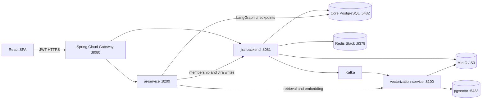

# Sprint Orchestra Core

Backend and AI platform for a Jira-style sprint workspace. The repository contains the Spring core
API and gateway, an event-driven vectorization service, a corrective-RAG agent, durable LangGraph
workflows, local infrastructure, evaluation suites, load tests, and observability tooling. The React
SPA lives in the sibling `sprint-orchestra-studio` repository.

This is a portfolio/demo system with meaningful production-oriented controls and measured results;
it is not yet a hardened multi-tenant production deployment. The remaining security gaps are listed
explicitly below.

## What is implemented

- Jira-like spaces, sprints, issues, comments, attachments, groups, GitHub links, and sprint history.
- JWT validation and routing at Spring Cloud Gateway, with trusted identity headers replaced from
  validated claims rather than accepted from the client.
- PostgreSQL/Flyway core schema (`V1` through `V26`), Redis Stack, MinIO/S3-compatible storage, and
  Kafka content/history/attachment events.
- Event-driven RAG ingestion: HTML/document extraction, OCR/VLM fallbacks, contextual retrieval,
  configurable token chunking, embeddings, pgvector, PostgreSQL FTS, RRF fusion, and cross-encoder
  reranking.
- Corrective RAG with citations, abstention, exact metadata/history tools, runtime verification,
  Redis-backed semantic caching, streaming progress, cost/latency metrics, and offline RAGAS/eval
  harnesses.
- AI task drafting, epic planning, sprint health analysis, durable human-approved epic rollout, and
  durable sprint-recovery workflows with Postgres checkpoints, retry, history, and time travel.
- Optional LiteLLM gateway, local vLLM proof, Prometheus/Grafana/Phoenix overlay, and Locust tests.
- MCP is a planned integration; no MCP server/client is claimed as implemented yet.

## Runtime architecture



Browser traffic enters through the gateway. Ports `8081`, `8100`, and `8200` are internal service
ports and must not be exposed directly in a public deployment: direct AI calls without gateway user
headers are intentionally treated as trusted internal calls for local eval scripts.

## Repository map

| Path | Responsibility |
|------|----------------|
| `gateway/` | JWT validation, identity propagation, rate limits, circuit breakers, and routing |
| `jira-backend/` | Spring Boot domain API, OLTP data, FTS, object storage, and Kafka publishing |
| `vectorization-service/` | Kafka ingestion, document extraction/chunking, embeddings, pgvector, hybrid retrieval, reranking |
| `ai-service/` | Corrective RAG, structured tools, drafting/planning, LangGraph rollout and sprint recovery |
| `docs/` | Architecture, schema/API design, and an ER diagram |
| `observability/` | Optional Prometheus, Grafana, and Phoenix overlay |
| `litellm-gateway/` | Optional provider gateway with rate and spend controls |
| `vllm-server/` | Local vLLM deployment proof |
| `loadtest/` | Locust workloads and measured results |
| `scripts/` | Local stack and test orchestration |

Important documents:

- [Architecture](docs/ARCHITECTURE.md)
- [AI service](ai-service/README.md)
- [Vectorization service](vectorization-service/README.md)
- [Database schema](docs/DATABASE_SCHEMA_CORE.md)
- [Core API design](docs/API_DESIGN_CORE.md)

## Local development

Prerequisites: JDK 17, Python 3.11, Docker Compose, and Node 20+ for the separate SPA. A hosted LLM
or a tool-calling OpenAI-compatible local server is required for real AI calls; hermetic unit tests
do not require one.

The simplest path is:

```bash
# Create each Python venv once and install its requirements first.
scripts/dev_up.sh
scripts/dev_up.sh status
```

`dev_up.sh` starts or reuses Compose infrastructure, `jira-backend`, the gateway, both Python
services, and the sibling SPA. It checks but does not launch the external local-model application.
Processes started by the script write logs below `/tmp/sprint-orchestra-dev/` and can be stopped with
`scripts/dev_up.sh down`.

Manual startup:

```bash
docker compose up -d
./gradlew :jira-backend:bootRun
./gradlew :gateway:bootRun

cd vectorization-service
python -m venv .venv && source .venv/bin/activate
pip install -r requirements.txt
cp .env.example .env
uvicorn app.main:app --port 8100

cd ../ai-service
python -m venv .venv && source .venv/bin/activate
pip install -r requirements.txt
cp .env.example .env
uvicorn app.main:app --host 127.0.0.1 --port 8200
```

Default infrastructure:

| Service | Port | Notes |
|---------|------|-------|
| gateway | 8080 | Browser/API entry point |
| jira-backend | 8081 | Internal core API |
| vectorization-service | 8100 | Internal retrieval API |
| ai-service | 8200 | Internal AI API |
| PostgreSQL | 5432 | Core data and LangGraph checkpoints |
| pgvector PostgreSQL | 5433 | Vectorization-owned index |
| Redis Stack | 6379 | Spring cache and AI semantic cache/RediSearch |
| Kafka / Kafka UI | 9092 / 8989 | Event bus and local UI |
| MinIO API / console | 9000 / 9001 | Attachment object storage |
| LiteLLM | 4000 | Optional `litellm` Compose profile |

AI defaults enable Redis caching, durable rollout, sprint recovery, and its Kafka trigger. For a
minimal standalone AI process, either start Redis/Postgres/Kafka or explicitly disable the features
in `ai-service/.env.example`.

## API entry points

Use the gateway prefix for browser calls:

| Area | Gateway path |
|------|--------------|
| Auth | `/api/auth/**` |
| Core Jira API | `/api/**` |
| Ask AI and AI workflows | `/api/ai/**` |
| Swagger UI | `/swagger-ui.html` |
| OpenAPI JSON | `/v3/api-docs` |

The internal Python endpoints and their exact request/response shapes are documented in the two
service READMEs and generated FastAPI OpenAPI documents.

## Data and RAG flow

1. A committed issue, comment, history, or attachment change emits a Kafka event.
2. `vectorization-service` consumes at least once and applies deterministic upserts/deletes to its
   own pgvector/FTS store. Attachment binaries are fetched from MinIO/S3.
3. `/search` combines dense and lexical ranks using RRF and optionally reranks candidates with a
   cross-encoder. Structured endpoints provide exact issue, sprint, comment, detail, attachment, and
   transition data when semantic top-k retrieval is the wrong abstraction.
4. `ai-service` exposes seven model tools and injects the caller's authorized `space_ids` in code.
   The model can select queries and filters but cannot expand authorization scope.
5. The CRAG loop can reformulate and retrieve again, then verifies grounded claims, returns citations,
   or uses the fixed abstention contract when evidence is insufficient.

The durable workflows use LangGraph with Postgres checkpointing:

- Epic rollout pauses for approval before any Jira write and supports idempotent resume/retry.
- Sprint recovery diagnoses risk, clarifies missing facts, proposes a plan, pauses for human review,
  executes approved actions, and supports re-evaluation/history/time travel.
- Workflow reads and mutations are owner-authorized and recheck space membership on resume.

## Configuration

Configuration is environment-driven. Start from:

- `ai-service/.env.example`
- `vectorization-service/.env.example`
- `jira-backend/src/main/resources/application.yml`
- `gateway/src/main/resources/application.yml`

The three trust settings must agree outside local development:

- `APP_JWT_SECRET` between token issuer and gateway validator.
- `INTERNAL_GATEWAY_TOKEN`, backend `app.security.internal-gateway-token`, and
  `AI_INTERNAL_GATEWAY_TOKEN`.
- The public frontend origin in gateway/backend CORS configuration.

Never deploy with the repository's development secrets or plaintext defaults.

## Build and test

Run the CI-equivalent suites locally:

```bash
scripts/run_all_tests.sh

# Individual suites
scripts/run_all_tests.sh ai
scripts/run_all_tests.sh vec
scripts/run_all_tests.sh backend
scripts/run_all_tests.sh gateway
```

The AI durable-workflow integration tests use PostgreSQL when reachable; CI starts an isolated
Postgres service so crash/resume cases cannot silently remain skipped. GitHub Actions runs all four
service suites from `.github/workflows/ci.yml`.

Additional non-unit evidence lives in:

- `vectorization-service/eval/` and `ai-service/eval/` for retrieval, grounding, prompt-injection,
  drafting stability, and planning comparisons.
- `loadtest/` for controlled prototype-scale concurrency measurements.
- `observability/` for Prometheus/Grafana metrics and Phoenix LLM traces.

## Security posture and known gaps

Implemented controls include JWT validation at the gateway, replacement of spoofable identity/trust
headers, space-scoped AI retrieval, workflow-owner checks, resume-time membership checks, bounded
agent/workflow loops, and idempotent durable writes.

Before handling real users or exposing this publicly, at minimum:

- Protect or remove the currently public `/api/users/**` gateway routes and replace development
  plaintext-password handling with a modern password hash or external IdP.
- Enforce membership/role authorization consistently on every core resource mutation and remove APIs
  that accept an arbitrary user id as their authorization source.
- Bind internal ports to private interfaces/security groups; expose only HTTPS at the gateway or a
  hardened reverse proxy/WAF.
- Replace default JWT/internal/LiteLLM/DB/MinIO secrets, restrict CORS, enable TLS, and store secrets
  in a managed secret store.
- Add an outbox/CDC publisher and DLQ. The current `AFTER_COMMIT` Kafka publisher has a crash window
  between database commit and publish.
- Add end-to-end distributed tracing. Request-id correlation, Prometheus/Grafana, and partial Phoenix
  LLM tracing exist, but they are not a complete cross-service trace.

This is deliberately not labeled production-ready.
