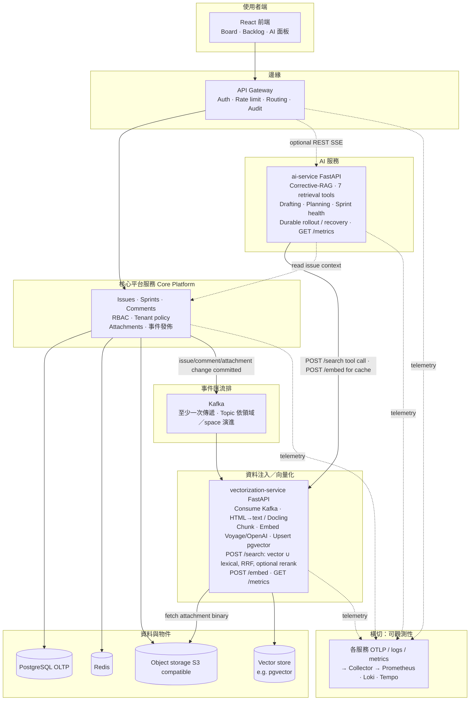
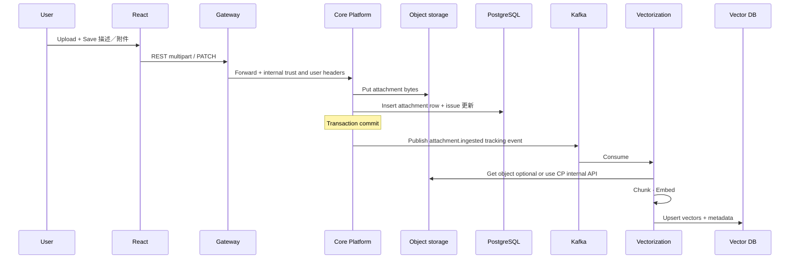

# 平台架構設計（更新版）

本文取代先前「編號 ①～⑫」較細拆的版本，對齊目前決策：**核心後端合併**、**附件 Save 後進 Kafka**、**暫不引入 Flink**、**獨立 Vectorization 服務**、**獨立 AI 服務**，以及 **可觀測性作為橫切能力**（不畫成獨立業務服務）。

---

## 1. 設計原則

| 原則 | 說明 |
|------|------|
| **邊緣與核心分離** | Browser 只經由 **API Gateway** 進入後端；統一 auth、rate limit、routing、audit。 |
| **單一核心平台服務** | 原 ② Identity / RBAC、③ Issue 領域、④附件處理_trigger **合併為一個 Core Platform Service**（實務上可對應今日 monorepo 的 `jira-backend` + 未來模組化）。issue / comment 的建立、修改、刪除，以及附件的上傳／刪除，都在 **交易提交後（`AFTER_COMMIT`）** 發 Kafka 事件。 |
| **FTS 留在 Core** | **全文檢索（Postgres `tsvector` / GIN / pg_trgm）不獨立成服務**：索引就長在 Core 自己的 `issues` / `comments` 表上，Postgres 在寫入時原生維護，查詢邏輯留在 `SearchService`。把它抽出去只會多一份重複資料，沒有實質收益。真正需要解耦的是 **embedding**（呼叫慢、會失敗、需重試的外部模型 API）。 |
| **事件驅動灌資料** | Kafka 作為 **decoupling buffer**；**不經 Flink**（串流運算層暫緩）。兩個 ingestion topic：`jira.content.ingestion`（issue / comment 文字）與 `jira.attachment.ingestion`（附件二進位定位符）。 |
| **Vectorization 獨立（已建置）** | **`vectorization-service`**（FastAPI）：消費上述兩個 topic，HTML→text／Docling 抽取附件、（可選）**contextual retrieval** 補上下文、token+overlap 切 chunk、呼叫 embedding（Voyage／OpenAI）、以 **決定性 key upsert** 進 **pgvector**。負責 **RAG data ingestion（寫索引）**，同時擁有索引的 **raw 查詢入口**（`POST /search`：vector ∪ lexical，RRF 融合排序，可選 **cross-encoder rerank** 二階段重排）與 **embedding 原語**（`POST /embed`，供 ai-service 語意快取重用）——寫、查詢、embedding 原語同屬索引擁有者，互動式 agent 組合邏輯不在此。 |
| **AI 能力單一服務（已建置）** | **`ai-service`**（FastAPI）：agentic/Corrective RAG、七個檢索工具、引用與驗證、token/cost 追蹤、Redis Stack 語意快取、task drafting、epic planning、sprint health，及兩條 Postgres-checkpointed LangGraph durable workflows（epic rollout、sprint recovery）。 |
| **可觀測性：兩服務已有 metrics，跨服務 tracing 仍預留** | `vectorization-service` 與 `ai-service` 皆已實作 `GET /metrics`（Prometheus text format：request latency + 各自 pipeline 的 stage-level histogram）與 request-id 關聯的結構化 log（`app/observability.py`）；**尚未**接上跨服務的 distributed tracing（OpenTelemetry spans 串 Core → Kafka → Vectorization → AI 的完整 request 路徑）——已實作的部分足以回答「單一服務內哪個 stage 慢」，跨服務因果鏈仍待 OTel。不在架構圖上單獨畫「Observability Service」；未來跨服務 trace 由 **共用 Collector / 後端**（Prometheus、Loki、Tempo/Jaeger 等）承接。 |

---

## 2. 與舊版編號對照（摘要）

| 舊元件 | 新版 |
|--------|------|
| ① Gateway | **保留** |
| ② Identity & Access | **併入 Core Platform Service** |
| ③ Issue Core | **併入 Core Platform Service** |
| ④ Attachment processing | **併入 Core Platform Service**；Save 後 **publish Kafka** |
| ⑤ Kafka | **保留**（topic 策略可依 space / event type 演進） |
| ⑥ Flink | **移除（現階段）** |
| ⑦ Knowledge index | **與 vectorization 管線合併** → **Vectorization Service**（`vectorization-service`，已建置）。FTS 索引不在此，留在 Core；vectorization 另有自己的 chunk-granularity lexical index 用於 hybrid fusion，兩者用途不同（見 §3 附註）。 |
| ⑧ Vector retrieval | Raw hybrid retrieval/rerank 由索引擁有者 **Vectorization Service** 提供；AI Service 透過 `/search` 組合 tool loop 並決定是否改寫 query 再檢索 |
| ⑨ Agent orchestration | **併入 AI Service**（已建置：Claude tool use 驅動的 corrective-retrieval loop，見 §5） |
| ⑩ Sprint intelligence | **併入 AI Service**（已實作 `POST /sprint-pace` 與 durable sprint-recovery workflow） |
| ⑪ AI observability | **併入 AI Service**（對內模組／dashboard；對外仍走共用 OTel） |
| ⑫ Platform observability | **不獨立成業務服務** → **全服務統一埋點 + 共用Observability 後端** |

---

## 3. 目標邏輯架構

**說明：**

- **Core → Kafka**：issue / comment / 附件變更皆在交易提交後（`AFTER_COMMIT`）發佈。issue / comment 事件把文字直接放進 payload（小、免回讀 Core DB）；附件事件只放 `s3://` 定位符，由 vectorization-service 自行拉檔。刪除有專屬事件（`issue_deleted` / `comment_deleted` / `attachment_deleted`）——向量庫是另一份複製資料，Postgres cascade 刪不到它，沒有刪除事件會留下 stale index。
- **Gateway → AI**：若 AI 能力走獨立路由或不同 scaling profile，可由 Gateway 分流；亦可由 Core 內部 HTTP 呼叫 AI（視邊界與延遲需求而定）。
- **Vectorization**：擁有 RAG index 的寫入與 raw read primitives；以決定性 key upsert（`issue:{id}` / `comment:{id}` / `attachment:{id}#{n}`）保證 Kafka 至少一次傳遞下的冪等，並提供 hybrid retrieval / rerank。多步 agent orchestration 與回答合成才屬 AI Service。
- **FTS vs Vector**：兩種索引各司其職——FTS（lexical，exact / 關鍵字）由 Core + Postgres 就地維護；vector（semantic）由本服務寫入 pgvector。未來 hybrid retrieval 的「組合」邏輯落在 AI Service，而非灌資料端。

---

## 4. 事件與資料流（附件 → RAG）

---

## 5. AI Service 邊界（合併 ⑧⑨⑩⑪）

對外可視為 **單一部署單元**，對內建議模組：

| 模組 | 職責 | 現況 |
|------|------|------|
| **Retrieval** | Hybrid search、rerank、top-k、citation 準備 | Hybrid search 已實作（呼叫 vectorization-service `/search`）；**rerank 已實作**，但落在 vectorization-service 那側（索引擁有者一併提供 cross-encoder 二階段重排，`VEC_RERANK_ENABLED`）——ai-service 收到的已是（可選）重排過的結果，這裡不重複做 |
| **Agents** | Planner、tool 呼叫、多步推理；未來 MCP | 已實作：**Corrective RAG loop**（`app/agent/crag_loop.py`）與七個內部 tools；MCP server/client 尚未實作，授權 contract 先列為後續項目 |
| **Domain intelligence** | Sprint／board 風險分析與修復流程 | 已實作：`POST /sprint-pace`；LangGraph sprint recovery 支援 clarification、human approval、idempotent execute、retry、Kafka re-evaluation、history 與 time travel |
| **AI Ops** | Token／latency／retrieval quality 指標；對平台 OTel 匯出 | **Token/cost 已實作**（每次 `/ask` 回傳 `estimated_cost_usd`，`GET /stats` 累計）；**Latency 已實作**（`GET /metrics`，Prometheus，見 §6）；跨服務 OTel 匯出仍預留。另有一套可重跑的 **agentic eval harness**（`ai-service/eval/`，LLM-as-judge 評分 groundedness / abstention / retrieval 正確性）取代手動驗證 |
| **Cache** | 查詢結果快取，降低重複問題的延遲與成本 | 已實作：exact-match + 語意（embedding cosine similarity）兩層快取（`app/cache/semantic_cache.py`），對 `space_ids` 嚴格隔離，TTL-only 失效（見 ai-service README「Semantic query cache」） |

對使用者仍是一個 **AI API**（`POST /ask`）；對維運是一個 **process**，負載與版本獨立於 Core。

**安全邊界**：`search_knowledge_base` 這個 tool 只讓 model 控制 `query`／`mode`，**絕不讓 model 控制 `space_ids`**——權限範圍由呼叫端（已驗證身份的使用者）注入，每次檢索呼叫都用同一組，不管 model 在 tool call 裡填了什麼。這跟 jira-backend FTS 的空間權限過濾是同一條防線，只是這裡的威脅模型多了一個：agent 有可能被 prompt injection 騙去查詢使用者無權限的 space,所以授權參數絕對不能交給 model 決定。

---

## 6. 可觀測性（取代獨立「⑫ 服務」）

**現況（已實作，非僅規劃）：**

- `vectorization-service`、`ai-service` 皆有 `GET /metrics`（`prometheus_client`，text format）：request latency（依 method+path 分類）+ 各自 pipeline 的 stage-level histogram（VS：`search_embed_seconds` / `search_retrieval_seconds` / `search_rerank_seconds`；AI：`agent_llm_call_seconds` / `agent_retrieval_call_seconds` / `agent_cache_lookup_seconds` / `agent_retrieval_rounds` 分佈 / `agent_cache_hits_total`）。
- 每個 request 有 id（`ObservabilityMiddleware`，`app/observability.py`，經 `ContextVar` 傳遞、`x-request-id` response header 回傳），結構化 JSON log 帶上同一個 id 與 stage 耗時明細，metric 與 log 用同一個計時器量測，兩者不會兜不起來。
- 本地驗證方式：Prometheus 指向 `:8100/metrics`、`:8200/metrics`；`docker-compose.yml` 目前未內建 Prometheus/Grafana container（避免預設就多跑兩個服務），需要時可疊加一份 observability overlay compose 檔。

**部分做了（值得說明差異在哪）：**

- `ai-service` 呼叫 vectorization-service 的 `/search`、`/embed` 時，會把自己這次 request 的 `x-request-id` 一併轉發下去（`RetrievalClient`／`EmbeddingClient`，見 `app/agent/retrieval_tool.py`／`app/cache/embedding_client.py`）——所以同一個 id 現在會同時出現在 ai-service 與 vectorization-service 兩邊的 log 裡，可以手動 grep 串起「這次 `/ask` 觸發了哪幾次 `/search`」。這**不是** distributed tracing（沒有 span、沒有 parent-child 呼叫關係、沒有可視化），只是一個共用的關聯 id，成本很低但已經比完全不相關聯有用。

**尚未做（誠實列出，非疏漏）：**

1. **真正的 distributed tracing**（OpenTelemetry spans）：目前的 `x-request-id` 轉發只給了「同一個 id」，沒有完整 Core → Kafka → Vectorization → AI 的 parent-child span 因果鏈。AI 的 Phoenix tracing 只涵蓋文件中列明的 LLM client 路徑。
2. **統一 logs/traces backend**：`observability/docker-compose.observability.yml` 已提供可選的 Prometheus + Grafana + Phoenix overlay 與自動載入 dashboard；Loki、Tempo/Jaeger 與完整跨服務 trace 仍未導入。因此不是「沒有 dashboard」，也不是「全平台 tracing 已完成」。

---

## 7. 與本 monorepo 現況對照（演進中）

| 目標元件 | 目前實作 |
|----------|----------|
| React 前端 | 獨立 repo **`sprint-orchestra-studio`** |
| API Gateway | **`gateway`** 子專案 |
| Core Platform（含附件 + Kafka publish） | **`jira-backend`**（附件 + issue/comment content 事件皆已發佈）；FTS 亦在此（`SearchService`） |
| Kafka | Compose + optional producer；**`tmp-kafka-consumer-poc`** 僅 POC |
| Vectorization Service | **`vectorization-service`**（FastAPI，已建置）：Kafka → chunk → embed → pgvector；`POST /search`（vector ∪ lexical，RRF，選用 cross-encoder rerank）；`POST /embed`；`GET /metrics`；contextual retrieval（選用）；自帶 `vecdb`（compose，:5433） |
| AI Service | **`ai-service`**（FastAPI，已建置）：Corrective RAG、七個 space-scoped tools、Redis Stack 語意快取、streaming、drafting/planning、sprint health、durable epic rollout 與 sprint recovery、token/cost、`GET /metrics` |
| 併發驗證 | **`loadtest/`**（Locust）：對兩服務跑真實併發測試，`vectorization-service` 50 併發、0 失敗；過程中在 `ai-service` 找到並修復 2 個真實 bug，詳見 `loadtest/README.md` |
| 雲端部署 | 單一 EC2 的 portfolio deployment 規劃；只公開 HTTPS gateway，內部服務 ports 不得直接曝露。尚未完成的 backend resource-level RBAC 使它不應被宣稱為 production-ready |
| 統一 OTel（跨服務 tracing） | **待導入**；兩服務已各自有 `/metrics` + request-id 轉發（見 §6），差跨服務 span |

---

## 8. 後續可選文件化

- Topic 命名與 **schema 版本**（JSON / Avro）與 consumer group 慣例。
- Vectorization 與 Core 的 **讀檔策略**（signed URL vs 內部 service account）。
- MCP server/client 的工具 contract、授權傳遞與 threat model（目前規劃中，尚未實作）。

---

若此架構要同步進簡報或 Confluence，可直接匯出 Mermaid；需要英文版平行文件可再開 `ARCHITECTURE.en.md`。
