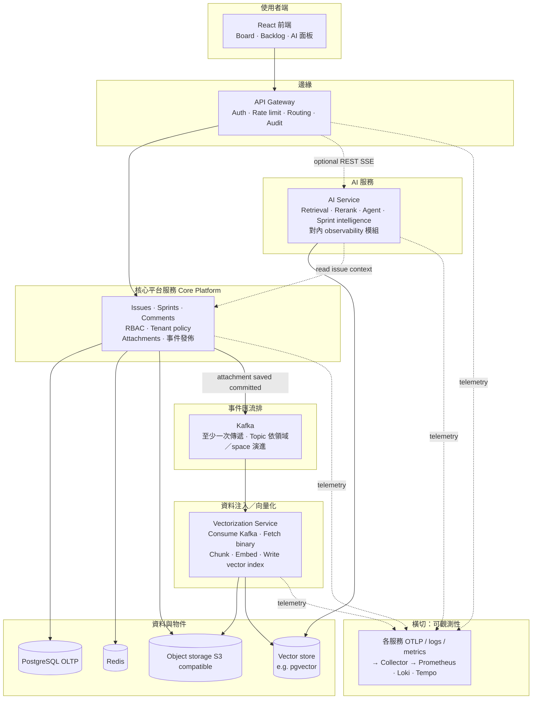
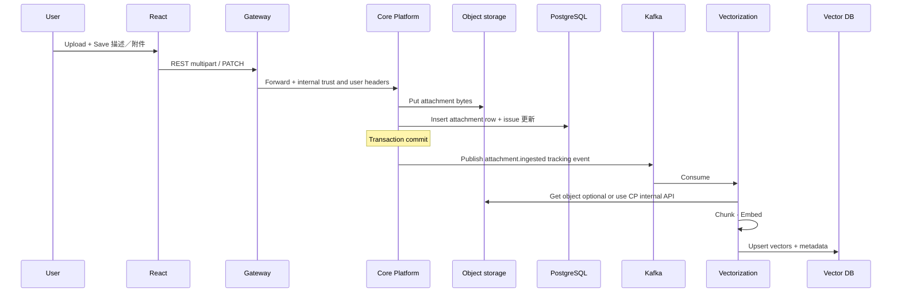

# 平台架構設計（更新版）

本文取代先前「編號 ①～⑫」較細拆的版本，對齊目前決策：**核心後端合併**、**附件 Save 後進 Kafka**、**暫不引入 Flink**、**獨立 Vectorization 服務**、**獨立 AI 服務**，以及 **可觀測性作為橫切能力**（不畫成獨立業務服務）。

---

## 1. 設計原則

| 原則 | 說明 |
|------|------|
| **邊緣與核心分離** | Browser 只經由 **API Gateway** 進入後端；統一 auth、rate limit、routing、audit。 |
| **單一核心平台服務** | 原 ② Identity / RBAC、③ Issue 領域、④附件處理_trigger **合併為一個 Core Platform Service**（實務上可對應今日 monorepo 的 `jira-backend` + 未來模組化）。附件在上傳並 **Save（交易提交）後** 發 Kafka 事件。 |
| **事件驅動灌資料** | Kafka 作為 **decoupling buffer**；**不經 Flink**（串流運算層暫緩）。 |
| **Vectorization 獨立** | 原「附件語意／索引準備」與 **Knowledge Index（chunk / embed / vector store）** 合併為 **Vectorization Service**：消費 Kafka、讀物件儲存或經 API 拉檔、寫入向量庫與索引 metadata。 |
| **AI 能力單一服務** | 原 Hybrid retrieval、Agent orchestration、Sprint intelligence、AI observability **合併為一個 AI Service**：對外暴露 RAG / agentic API，內部再分子模組即可。 |
| **可觀測性非獨立業務服務** | 不在架構圖上單獨畫「Observability Service」；**每個進程**輸出 **結構化 log + metrics + traces**（例如 OpenTelemetry），由 **共用 Collector / 後端**（Prometheus、Loki、Tempo/Jaeger 等）承接。 |

---

## 2. 與舊版編號對照（摘要）

| 舊元件 | 新版 |
|--------|------|
| ① Gateway | **保留** |
| ② Identity & Access | **併入 Core Platform Service** |
| ③ Issue Core | **併入 Core Platform Service** |
| ④ Attachment processing | **併入 Core Platform Service**；Save 後 **publish Kafka** |
| ⑤ Kafka | **保留**（topic 策略可依 space / event type 演進） |
| ⑥ Flink | **移除（現階段）** |
| ⑦ Knowledge index | **與 vectorization 管線合併** → **Vectorization Service** |
| ⑧ Vector retrieval | **併入 AI Service** |
| ⑨ Agent orchestration | **併入 AI Service** |
| ⑩ Sprint intelligence | **併入 AI Service** |
| ⑪ AI observability | **併入 AI Service**（對內模組／dashboard；對外仍走共用 OTel） |
| ⑫ Platform observability | **不獨立成業務服務** → **全服務統一埋點 + 共用Observability 後端** |

---

## 3. 目標邏輯架構

**說明：**

- **Core → Kafka**：僅在附件已成功持久化（含 metadata）且交易提交後發佈（與現有 `AFTER_COMMIT` 語意一致）。
- **Gateway → AI**：若 AI 能力走獨立路由或不同 scaling profile，可由 Gateway 分流；亦可由 Core 內部 HTTP 呼叫 AI（視邊界與延遲需求而定）。
- **Vectorization**：專責 **data ingestion for RAG**；不承載互動式 agent 編排，避免職責膨脹。

---

## 4. 事件與資料流（附件 → RAG）

---

## 5. AI Service 邊界（合併 ⑧⑨⑩⑪）

對外可視為 **單一部署單元**，對內建議模組：

| 模組 | 職責 |
|------|------|
| **Retrieval** | Hybrid search、rerank、top-k、citation 準備 |
| **Agents** | Planner、tool/MCP 呼叫、多步推理 |
| **Domain intelligence** | Sprint／board 相關 heuristics 或微調流程 |
| **AI Ops** | Token／latency／retrieval quality 指標；對平台 OTel 匯出 |

對使用者仍是一個 **AI API**；對維運是一個 **process**，負載與版本獨立於 Core。

---

## 6. 可觀測性（取代獨立「⑫ 服務」）

**建議做法：**

1. **標準 SDK**：各服務（Gateway、Core、Vectorization、AI）整合 **OpenTelemetry**（traces + metrics + bridge logs）。
2. **統一出口**：Agent / Collector → **Prometheus**（metrics）、**Loki** 或等同（logs）、**Tempo/Jaeger**（traces）。
3. **關聯**：Kafka `eventId` / `trace_id` 貫穿 Core publish → Vectorization consume → AI retrieval。
4. **不在邏輯架構圖單獨畫「Observability Microservice」**，避免與業務邊界混淆；改在 **部署圖**標註 Collector 與儀表（Grafana 等）。

---

## 7. 與本 monorepo 現況對照（演進中）

| 目標元件 | 目前實作 |
|----------|----------|
| React 前端 | 獨立 repo **`sprint-orchestra-studio`** |
| API Gateway | **`gateway`** 子專案 |
| Core Platform（含附件 + Kafka publish） | **`jira-backend`** |
| Kafka | Compose + optional producer；**`tmp-kafka-consumer-poc`** 僅 POC |
| Vectorization Service | **尚未建置**（設計預留） |
| AI Service | **尚未建置**（設計預留） |
| 統一 OTel | **待導入** |

---

## 8. 後續可選文件化

- Topic 命名與 **schema 版本**（JSON / Avro）與 consumer group 慣例。
- Vectorization 與 Core 的 **讀檔策略**（signed URL vs 內部 service account）。
- AI Service 與 Gateway 的 **route 前綴**與 **rate limit 分級**。

---

若此架構要同步進簡報或 Confluence，可直接匯出 Mermaid；需要英文版平行文件可再開 `ARCHITECTURE.en.md`。
